## レコめし

#### ■ サービス概要

**レコめし**は、LINEで冷蔵庫の写真を送るだけで始められる、食材の使い切りを応援するサービスです。AIが家にあるものを把握し、ぴったりのレシピを提案。さらに、その料理に必要な「足りないものだけ」をリストアップして、毎日の献立作りをお手伝いします。

#### ■ このサービスへの思い・作りたい理由

仕事から帰って冷蔵庫を開けた時、「今日の晩ごはん、何にしよう…」と、なんとなく気が重くなることはありませんか。使いかけの野菜やお肉を前に献立を考えるのは日々の小さな、でも確実な負担です。素敵なレシピサイトには美味しそうな料理が並んでいますが、日々向き合う「現実の食材」との間には、少し距離があるように感じていました。

そこで日々の献立決めの悩みを少しでも軽くしたいという思いから、サービスの名前に３つの意味を込めました。

* **Recognition (レコグニション = 認識)**
    LINEで送られた写真をAIが瞬時に**認識**し、食材をデータ化します。
* **Record (レコード = 記録)**
    認識した食材を、あなたの家の「在庫」として**記録**します。これにより、買いすぎや重複を防ぎます。
* **Recommend (レコメンド = 推薦)**
    記録された在庫データを元に、あなたに最適なレシピと買い物リストを**推薦**します。

カメラで食材を『**認識** (Recognition)』し、家庭の在庫を『**記録** (Record)』する。そして、あなたにぴったりの献立を『**推薦** (Recommend)』する。この３つの「レコ」で、あなたの食生活を支えるのが「レコめし」です。

#### ■ ユーザー層について

* **メインターゲット：毎日を賢く、そして丁寧に暮らしたいと考えている方々**
    * **理由**: 忙しい日々の中でも、時間やお金、食材を大切にしたいという思いを持つ方は多いと思います。このサービスは、そんな方々の「無駄なく、効率的に」というニーズに応え、日々の家事をサポートできると考えました。

* **セカンダリターゲット：自炊を始めたいけれど、食材の管理が少し難しいと感じている方**
    * **理由**: 一人暮らしなどで自炊を始めると、食材を余らせてしまうことがよくあります。このサービスが「次に買うべきもの」を明確にすることで、無理なく、無駄なく自炊を続けるためのお手伝いができると考えました。

#### ■ サービスの利用イメージ

例えば、朝出かける前に「今日の晩ごはん、どうしようかな」と考えながら、冷蔵庫の中を写真に撮ってLINEで送ります。AIがすぐに食材をデータ化し、あなたの家の「在庫」として記録してくれます。

そして仕事の帰り道、「今日の晩ごはん」とLINEを送るだけで、朝記録した食材を元にしたレシピ候補と、「買うべきは、鶏もも肉と生姜だけ」といった具体的な買い物リストが届きます。

日々の暮らしの中から「献立を考える」という手間を少し減らすことで、時間にささやかなゆとりが生まれ、気持ちも軽くなる。このサービスを通じて、そんな価値を届けたいと考えています。

#### ■ ユーザーの獲得について

* NoteやZennで制作過程を発信：学習・開発ログを発信することで、同じ学習者の関心を集める＋検索流入も狙います
* SNSでの宣伝

#### ■ サービスの差別化ポイント・推しポイント

1. 競合サービスの一般的なアプローチ

* レシピ検索型サービス（例: クックパッド、クラシルなど）  
レシピを探す時、まず「何を作るか」を決める必要がありました。しかし、本当に知りたいのは「今あるもので何が作れるか」だったりします。見つけたレシピと家の食材を見比べる作業も一手間だと思います。

* 対話型レシピ提案サービス（例: 特定のAIチャットなど）  
AIとの対話でレシピを提案してくれるサービスも便利ですが、提案されたレシピの材料が、必ずしも家に揃っているわけではありません。

2. 「レコめし」の独自性と強み

* 強み①：「家にあるもの」から発想する  
まず冷蔵庫の写真を送ることで、「今あるもの」の確認からスタートします。これにより、献立を考える上で最も基本となる「在庫確認」の手間を省くことを目指しました。

* 強み②：「買い物」までをサポートする  
レシピを提案するだけでなく、そのレシピを作るために「足りないものだけの買い物リスト」までを自動で作ります。これにより、レシピを見た後に「何を買えばいいんだっけ？」と考える必要がなくなります。

#### ■ 機能候補

* **MVPリリース時に作りたいもの**
    * LINEでの対話機能（Webhook）
    * 画像認識による食材登録機能
    * LIFFを使った食材リストの編集・確認機能
    * LLMによるレシピ提案機能
    * 買い物リスト自動生成機能
    * 基本的な認証機能（ユーザー登録、ログイン）
    * レシピ履歴表示機能

* **本リリースまでに作りたいもの**
    * Webアプリ上でのユーザー設定機能（何人分、アレルギー、苦手な食材など）
    * お気に入りレシピの保存機能
    * 通知機能（レシピ提案、在庫確認リマインダー等）
    * パスワード・メールアドレス変更機能
    * レシピのフィルタリング・検索機能
    * 非同期処理の導入 (Sidekiq等): ユーザー体験向上のため、時間のかかるAPI通信（画像認識、LLMへの問い合わせ）をバックグラウンドで実行し、待ち時間をなくします。

#### ■ 機能の実装方針予定

* **フロントエンド (LIFF)**: **React** を採用予定。LINE LIFF SDKを使い、バックエンドとの通信は**axios**で行う。
* **バックエンド**: **Ruby on Rails (APIモード)**。非同期処理のために Sidekiq と Redis を導入予定。
* **データベース**: **PostgreSQL**
* **画像認識**: **Google Cloud Vision API** を利用。RailsのサービスクラスでAPIを呼び出し、返された食材ラベルを処理する。
* **レシピ提案**: **OpenAI API** または **Google Gemini API** を利用。家にある食材リストやユーザーの要望をプロンプトに組み込み、JSON形式でレシピを生成させる。
* **認証**: LIFFから取得した**IDトークン**をRails側で検証し、リクエスト元のユーザーを安全に特定する。

---

#### React のキャッチアップ状況について

* 以前のカリキュラムの発展STEPは一通り学習済みです。また、Reactを使用したアプリを開発したことがあり、コンポーネント作成や状態管理、API連携といった基本的な部分は経験しておりますので、今回の開発も問題なく進められると考えています。
* LIFFと連携させる部分は初めての挑戦となりますので、ドキュメントなどを確認しながら慎重に進めていきます。

---

### ■ 画面遷移図
Figma : https://www.figma.com/design/4ZFqeNbGgZQqJvzzgT31hK/Reco_Meshi?node-id=0-1&p=f&t=yDsScvfzwXBj3qSO-0

### 実装予定機能

#### 認証・アカウント管理機能
- [ ] ユーザー登録機能
- [ ] ログイン機能（Web版）
- [ ] LINE認証機能
- [ ] パスワード変更機能
- [ ] メールアドレス変更機能
- [ ] プロフィール編集機能

#### 食材管理機能
- [ ] 画像認識による食材登録機能（冷蔵庫の写真から）
- [ ] 食材リスト表示機能
- [ ] 食材の手動追加・編集・削除機能
- [ ] 食材の在庫数量管理機能

#### レシピ関連機能
- [ ] AIによるレシピ提案機能（今ある食材から）
- [ ] レシピ詳細表示機能
- [ ] レシピ履歴表示機能
- [ ] お気に入りレシピ登録機能
- [ ] レシピ検索・フィルタリング機能

#### 買い物リスト機能
- [ ] 買い物リスト自動生成機能（レシピに必要な不足食材）
- [ ] 買い物リストの編集機能
- [ ] 買い物完了チェック機能

#### 設定・カスタマイズ機能
- [ ] 家族人数設定
- [ ] アレルギー食材登録機能
- [ ] 苦手な食材登録機能
- [ ] 通知設定（レシピ提案通知、在庫確認リマインダー等）

#### LINE連携機能（LIFF）
- [ ] LINEトーク画面での対話機能
- [ ] 写真送信による食材認識
- [ ] レシピ提案の受信
- [ ] LIFFを使った詳細画面へのアクセス

### 未ログインでも閲覧または利用できるページ
以下の項目は適切に未ログインでも閲覧または利用できる画面遷移になっているか？
- [ ] ランディングページ（サービス紹介）
- [ ] 利用規約
- [ ] プライバシーポリシー
- [ ] お問い合わせフォーム
- [ ] ログイン画面
- [ ] ユーザー登録画面

### メールアドレス・パスワード変更確認項目
直接変更できるものではなく、一旦メールなどを介して専用のページで変更する画面遷移になっているか？
- [ ] メールアドレス
- [ ] パスワード

### 各画面の作り込み
画面遷移だけでなく、必要なボタンやフォームが確認できるくらい作り込めているか？
- [ ] 作り込みはある程度完了している（Figmaを見て画面の作成ができる状態にある）

### ER図

https://gyazo.com/b186592c661ddc18a1e1c4661f27c754

```mermaid
erDiagram
    users ||--o{ user_ingredients : ""
    users ||--o{ recipe_histories : ""
    users ||--o{ favorite_recipes : ""
    users ||--o{ shopping_lists : ""
    users ||--o{ allergy_ingredients : ""
    users ||--o{ disliked_ingredients : ""
    users ||--o| notification_settings : ""
    users ||--o| line_accounts : ""
    users ||--o{ fridge_images : ""
    
    ingredients ||--o{ user_ingredients : ""
    ingredients ||--o{ recipe_ingredients : ""
    ingredients ||--o{ allergy_ingredients : ""
    ingredients ||--o{ disliked_ingredients : ""
    ingredients ||--o{ shopping_list_items : ""
    
    recipes ||--o{ recipe_ingredients : ""
    recipes ||--o{ recipe_histories : ""
    recipes ||--o{ favorite_recipes : ""
    recipes ||--o{ shopping_lists : ""
    
    shopping_lists ||--o{ shopping_list_items : ""

    fridge_images ||--o{ user_ingredients : ""

    users {
        integer id PK
        string email
        string encrypted_password
        string name
        string reset_password_token
        timestamp reset_password_sent_at
        string confirmation_token
        timestamp confirmed_at
        timestamp confirmation_sent_at
        string unconfirmed_email
        timestamp remember_created_at
        timestamp created_at
        timestamp updated_at
    }

    line_accounts {
        integer id PK
        integer user_id FK
        string line_user_id
        string line_display_name
        string line_picture_url
        timestamp created_at
        timestamp updated_at
    }

    ingredients {
        integer id PK
        string name
        ingredient_category category "ENUM(vegetables, meat, fish, dairy, seasonings, others)"
        string unit
        timestamp created_at
        timestamp updated_at
    }

    user_ingredients {
        integer id PK
        integer user_id FK
        integer ingredient_id FK
        decimal quantity
        integer fridge_image_id FK
        timestamp created_at
        timestamp updated_at
    }

    recipes {
        integer id PK
        string title
        text description
        integer cooking_time
        integer serving_size
        recipe_difficulty difficulty "ENUM(easy, normal, hard)"
        text instructions
        string image_url
        timestamp created_at
        timestamp updated_at
    }

    recipe_ingredients {
        integer id PK
        integer recipe_id FK
        integer ingredient_id FK
        decimal quantity
        string unit
        boolean is_optional
        timestamp created_at
        timestamp updated_at
    }

    recipe_histories {
        integer id PK
        integer user_id FK
        integer recipe_id FK
        timestamp cooked_at
        text memo
        timestamp created_at
        timestamp updated_at
    }

    favorite_recipes {
        integer id PK
        integer user_id FK
        integer recipe_id FK
        timestamp created_at
        timestamp updated_at
    }

    shopping_lists {
        integer id PK
        integer user_id FK
        integer recipe_id FK
        shopping_list_status status "ENUM(active, completed, cancelled)"
        timestamp created_at
        timestamp updated_at
    }

    shopping_list_items {
        integer id PK
        integer shopping_list_id FK
        integer ingredient_id FK
        decimal quantity
        string unit
        boolean is_checked
        timestamp created_at
        timestamp updated_at
    }

    allergy_ingredients {
        integer id PK
        integer user_id FK
        integer ingredient_id FK
        timestamp created_at
        timestamp updated_at
    }

    disliked_ingredients {
        integer id PK
        integer user_id FK
        integer ingredient_id FK
        timestamp created_at
        timestamp updated_at
    }

    notification_settings {
        integer id PK
        integer user_id FK
        boolean recipe_suggestion_enabled
        time recipe_suggestion_time
        boolean inventory_reminder_enabled
        boolean email_notification_enabled
        timestamp created_at
        timestamp updated_at
    }

    fridge_images {
        integer id PK
        integer user_id FK
        string image_url
        jsonb recognized_ingredients
        jsonb image_metadata
        timestamp captured_at
        timestamp created_at
        timestamp updated_at
    }
```

